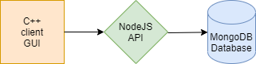

# NodeJS API
To connect the Client GUI to the online MongoDB database we made API in NodeJS that runs on a heroku server. The CSV data is send via the MQTT broker from the GUI to the API and then parsed and uploaded.
</br></br>

<p align="center">
  
</p>

</br></br>
To build the API in NodeJS you need to the following packages:
```
npm install nodejs
npm install mqtt
npm install mongoose
npm install express
```
To deploy it on a heroku server you have to install [heroku cli](https://devcenter.heroku.com/articles/heroku-cli)
